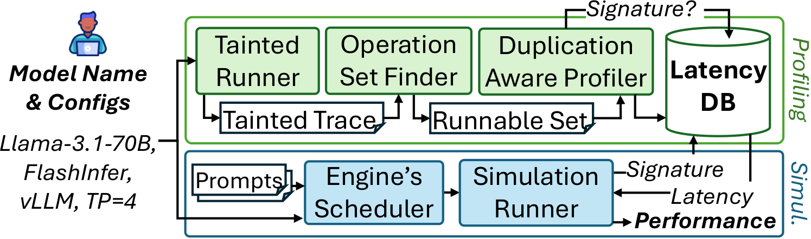

# Dooly: Configuration-Agnostic, Redundancy-Aware Profiling for LLM Inference Simulation

DoolyProf extracts all operations present in an LLM inference forward pass and efficiently profiles only those absent from its latency database. The resulting latency models can be used in downstream LLM inference tasks such as simulation (e.g., [DoolySim](https://github.com/dooly-project/doolysim), [Vidur](https://github.com/microsoft/vidur)) or in latency-prediction-based schedulers (e.g., [llm-d](https://llm-d.ai/blog/predicted-latency-based-scheduling-for-llms)).

📝 **Paper:** [Dooly: Configuration-Agnostic, Redundancy-Aware Profiling for LLM Inference Simulation](https://arxiv.org/abs/2605.07985)

📋 **Update Logs:** [Link to Update Logs](https://docs.google.com/document/d/1Pk2-mKBzs8rp7easJOBkoleeSF7Y3x_5kaugrzkNgpQ/edit?usp=sharing)

## Dooly System Overview


*Dooly system architecture overview and key ideas*

Selecting the optimal LLM inference configuration requires evaluation across hardware, serving engines, attention backends, and model architectures, since no single choice performs best across all workloads. 
**Profile-based simulators are the standard tool for this exploration, yet they hardcode their operation set to a specific configuration and re-profile every operation from scratch, making configuration sweeps prohibitively expensive.** 
Existing approaches treat each (model, engine, backend, hardware) combination as a fresh profiling target, ignoring the substantial overlap across configurations.

**Dooly takes a different approach:** it exploits structural redundancy in LLM inference to achieve **configuration-agnostic, redundancy-aware profiling**, profiling each unique operation only once and reusing it across all configurations that share it.

Our core insight is that every input dimension of every operation in an LLM forward pass is either fixed by the model configuration or determined by the incoming request, and that model-configuration values (head size, layer count, etc.) recur heavily across model families. Dooly exploits this through three key ideas:

1. **Taint propagation for dimension provenance.** Dooly performs a single inference pass and labels each input dimension of each operation with its origin (model config, request size, or derived combination) via taint propagation, exposing which operations are equivalent across configurations.
2. **Hierarchical context resolution for stateful operations.** Operations like attention carry implicit state that breaks naive operation extraction. Dooly isolates these by reusing the serving engine's own initialization code, eliminating the need for manual instrumentation.
3. **Duplication-aware profiling against a persistent database.** Dooly generates kernel-aware signatures for each operation and only profiles operations absent from its latency database, enabling cumulative reuse across runs and configurations.

## Repositories
- [**⏱️ DoolyProf**](https://github.com/dooly-project/doolyprof) — The profiler. Performs a single tainted inference pass and selectively profiles operations absent from the latency database.
- [**📊 DoolySim**](https://github.com/dooly-project/doolysim) — Reference simulator built on top of DoolyProf's latency database.

## Installation

Refer to indivudal repositories for installation instructions. 

## BibTex
```
@misc{kim2026doolyconfigurationagnosticredundancyawareprofiling,
      title={Dooly: Configuration-Agnostic, Redundancy-Aware Profiling for LLM Inference Simulation}, 
      author={Joon Ha Kim and Geon-Woo Kim and Anoop Rachakonda and Daehyeok Kim},
      year={2026},
      eprint={2605.07985},
      archivePrefix={arXiv},
      primaryClass={cs.DC},
      url={https://arxiv.org/abs/2605.07985}, 
}
```

## License

See individual repositories for license information.
